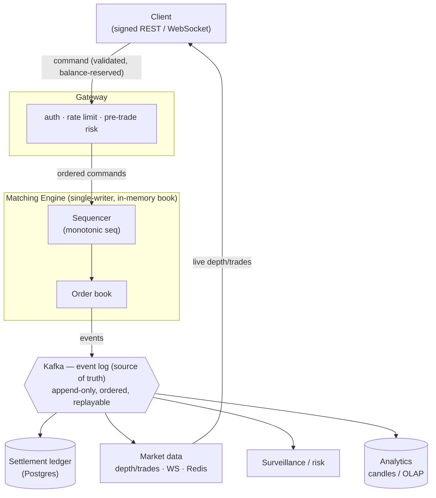

# MatchBox — Spot Order-Matching Exchange

A spot trading exchange built backend-first to learn **senior-level backend engineering**:
in-memory order-book design, single-writer/lock-free concurrency, event sourcing + CQRS,
double-entry settlement, low-GC latency engineering, and percentile-driven observability.

It is built **slowly and deliberately** — every phase intentionally creates a problem that a
later phase's tooling exists to solve. The design docs live in [docs/](docs/) and the backend
concepts behind each step in [concepts/](concepts/).

> **Status:** Phase 0 complete — the app boots, supports JWT register/login, and processes
> deposits through a double-entry ledger that always balances to zero.

---

## Tech stack

| Concern | Current (Phase 0) | Target (later phases) |
|--------|-------------------|------------------------|
| Language / runtime | **Java 21** (virtual threads, records) | + structured concurrency |
| Framework | **Spring Boot 3.4.5** (Web, Data JPA, Security, Validation, Actuator) | — |
| Database | **PostgreSQL 16** + **Flyway** migrations | + read replica |
| Auth | **Spring Security** + **JWT** (jjwt 0.12.6, HS256), BCrypt | + HMAC request signing, API keys |
| Build | **Maven** (`mvnw` wrapper) | — |
| Boilerplate | **Lombok** | — |
| Cache / queue | — | **Redis**, **Kafka** (event log) |
| Time-series / OLAP | — | **TimescaleDB / ClickHouse** |
| Observability | Actuator health/info | **Micrometer + Prometheus + Grafana**, **Tempo** tracing |

---

## Architecture

MatchBox is designed as a **modular monolith today**, evolving toward an **event-sourced,
CQRS system with a single-writer matching engine** as concurrency demands grow. The boundaries
are drawn now so a module (the matching engine) can later be lifted into its own process by
swapping in-process calls for a queue.

### Target architecture (Phases 3–6)



**Data flow:** a command is authenticated, risk-checked, and has funds reserved at the gateway;
the sequencer assigns a monotonic sequence number; the matching engine consumes commands
single-threaded, mutates the in-memory book, and emits events; every downstream concern
(settlement, market data, candles, surveillance) is a **read model** projected off the event
stream.

### Core design principles

1. **Single-writer matching path** — one thread owns the book; no locks on the hot path,
   handoff via a ring buffer (LMAX Disruptor pattern). The engine stays framework-free.
2. **Determinism** — same ordered command stream → identical event stream. No `now()`,
   randomness, or concurrent mutation on the hot path. Makes replay/testing/recovery trivial.
3. **Event sourcing as truth** — Postgres/ledger is a *projection*, not the master; snapshot
   periodically so replay isn't unbounded.
4. **Virtual threads at the edges** — I/O-bound gateway and WS fan-out use virtual threads; the
   matching thread stays a pinned platform thread.
5. **Reserve before you match** — pre-trade risk reserves funds at the gateway so the engine
   never touches the DB mid-match.
6. **Integer money** — prices/quantities are integer minor units (per-asset `scale`), never
   floating point.

### Where state lives (and why)

| Store | Holds | Why |
|-------|-------|-----|
| **Postgres** | accounts, ledger, balances, orders, trades | relational, transactional, durable, queryable |
| **Redis** *(later)* | nonces, rate limits, hot depth caches | in-memory, fast, auto-expiring |
| **Kafka** *(later)* | event log + command stream | durable, ordered, replayable |
| **TimescaleDB** *(later)* | candles / time-series | time-bucketed queries |
| **In-memory (engine)** *(later)* | the live order book | the hot path can't touch disk per match |

---

## Module structure

Packages under `com.matchbox`, organized by bounded context:

```
src/main/java/com/matchbox/
├── MatchboxApplication.java     Spring Boot entry point
├── account/                     users & trading accounts
│   ├── domain/                  User, Account
│   └── repo/                    UserRepository, AccountRepository
├── asset/                       tradable assets (USD, BTC, …)
│   ├── domain/                  Asset
│   └── repo/                    AssetRepository
├── settlement/                  double-entry ledger & balances
│   ├── domain/                  Balance, BalanceId, LedgerTransaction, LedgerEntry
│   ├── repo/                    Balance / LedgerEntry / LedgerTransaction repositories
│   ├── service/                 DepositService  (@Transactional ledger writes)
│   └── api/                     WalletController, DepositRequest
├── security/                    JWT auth
│   ├── JwtService               issue / verify HS256 tokens
│   ├── JwtAuthFilter            extracts accountId from Bearer token → SecurityContext
│   └── api/                     AuthController, RegisterRequest, LoginRequest
├── config/                      SecurityConfig (filter chain, BCrypt, stateless)
└── common/                      PingController (smoke test)
```

---

## Data model

All amounts are **integer minor units**; each asset declares a `scale` (e.g. USD scale 2, BTC
scale 8). Every balance change is recorded as a double-entry transaction whose ledger entries
sum to zero.

```
users ──1:1── accounts ──┬── balances     (account_id, asset_id) → available / reserved
                         └── ledger_entries ── transactions
assets ──────────────────┴── (referenced by balances & ledger_entries)
```

| Table | Key columns | Notes |
|-------|-------------|-------|
| `users` | `email` unique, `password_hash`, `status` | BCrypt hash; status ACTIVE/DISABLED |
| `accounts` | `user_id` unique (1:1) | one trading account per user |
| `assets` | `symbol` unique, `scale`, `name` | seeded with USD (2) and BTC (8) |
| `balances` | PK `(account_id, asset_id)` | `available`, `reserved`, `version` (optimistic lock); non-negative CHECK |
| `transactions` | `type` | DEPOSIT / WITHDRAW / ORDER_RESERVE / RELEASE / TRADE_SETTLE |
| `ledger_entries` | `transaction_id`, `account_id`, `asset_id`, `amount` | `amount <> 0`; debit + credit per transaction sum to zero |

A seeded **system account** (`system@matchbox.internal`) is the counterparty for deposits, so
the ledger balances: a user deposit credits the user (`+amount`) and debits the system account
(`-amount`).

---

## API

Base path `/v1`. Auth endpoints are public; everything else requires a `Bearer` JWT.

| Method | Path | Auth | Body | Description |
|--------|------|------|------|-------------|
| `POST` | `/v1/auth/register` | public | `{ "email", "password" }` | create user + account → `201` |
| `POST` | `/v1/auth/login` | public | `{ "email", "password" }` | → `{ access_token, token_type, expires_in }` |
| `POST` | `/v1/wallet/deposit` | JWT | `{ "assetId", "amount" }` | deposit funds (accountId from token) → `201` |
| `GET` | `/ping` | public | — | smoke test → `pong` |
| `GET` | `/actuator/health` | public | — | liveness |

The JWT subject is the **accountId**; `JwtAuthFilter` parses the `Authorization: Bearer <token>`
header and injects the accountId as the authentication principal, so controllers read it via
`@AuthenticationPrincipal Long accountId`. Sessions are stateless; access TTL defaults to 900s.

---

## Getting started

### Prerequisites
- JDK 21
- Docker (for Postgres) — or a local Postgres 16

### 1. Start Postgres

```bash
cp .env.example .env          # adjust if needed
docker compose up -d          # Postgres 16 on host port 5433
```

### 2. Run the app

```bash
./mvnw spring-boot:run
```

The app listens on **http://localhost:8081** (8080 is intentionally avoided). Flyway applies
migrations `V1–V6` on startup; Hibernate runs in `validate` mode (schema is owned by Flyway,
not the ORM).

### 3. Smoke test

```bash
# register
curl -X POST localhost:8081/v1/auth/register \
  -H 'Content-Type: application/json' \
  -d '{"email":"a@b.com","password":"secret123"}'

# login → grab access_token
curl -X POST localhost:8081/v1/auth/login \
  -H 'Content-Type: application/json' \
  -d '{"email":"a@b.com","password":"secret123"}'

# deposit (assetId 1 = USD), using the token
curl -X POST localhost:8081/v1/wallet/deposit \
  -H "Authorization: Bearer <access_token>" \
  -H 'Content-Type: application/json' \
  -d '{"assetId":1,"amount":"10000"}'
```

### Configuration

Key settings (env var → default), see [application.yml](src/main/resources/application.yml):

| Env var | Default | Purpose |
|---------|---------|---------|
| `SERVER_PORT` | `8081` | HTTP port |
| `DB_URL` | `jdbc:postgresql://localhost:5433/matchbox` | datasource |
| `DB_USER` / `DB_PASSWORD` | `matchbox` / `localdev` | DB credentials |
| `JWT_SIGNING_SECRET` | dev placeholder (≥32 bytes) | HS256 signing key |
| `JWT_ACCESS_TTL` | `900` | access-token lifetime (s) |
| `SPRING_PROFILES_ACTIVE` | `dev` | active profile (`dev` enables SQL logging) |

---

## Repository layout

This repo is also a structured learning log. Alongside the source code:

| Folder | What lives here |
|--------|-----------------|
| (source) | the actual exchange implementation |
| [`docs/`](docs/) | design docs for *our* exchange — requirements, data model, API contract, auth, architecture, NFRs |
| [`concepts/`](concepts/) | one file per backend **concept**, explained with the *why* — read before building the thing that uses it |
| [`syntax/`](syntax/) | "how do I express X in Java/Spring/SQL?" — syntax references and isolated snippets, **not** project code |

---

## Roadmap

Each phase: **Build / Learn / Done when**.

- [x] **Phase 0 — Skeleton + auth + wallet** — boots, JWT register/login, deposit, double-entry ledger balances to zero ✅
- [ ] **Phase 1 — Matching engine** — in-memory order book, price-time priority, LIMIT/MARKET/IOC/FOK, balance reservation; deterministic replay test
- [ ] **Phase 2 — Event sourcing + CQRS** — commands → sequencer → Kafka → events; ledger as a projection; snapshots + replay
- [ ] **Phase 3 — Market data + WebSocket** — depth/trade projections, WS fan-out, OHLC candles to TimescaleDB, Redis-cached depth
- [ ] **Phase 4 — Concurrency hardening** — ring-buffer/Disruptor handoff, virtual-thread gateway, multi-symbol sharding
- [ ] **Phase 5 — Memory & latency** — object pooling, GC tuning (G1 → ZGC), allocation profiling, hold p99/p999 under load
- [ ] **Phase 6 — Observability & settlement** — Micrometer percentiles, order-lifecycle tracing, consumer-lag metrics, scheduled ledger-vs-trade reconciliation

---

*Start at Phase 0. The value is in using each phase's tooling to debug the problems the
previous phases create — resist building Phase 5/6 tooling early.*
