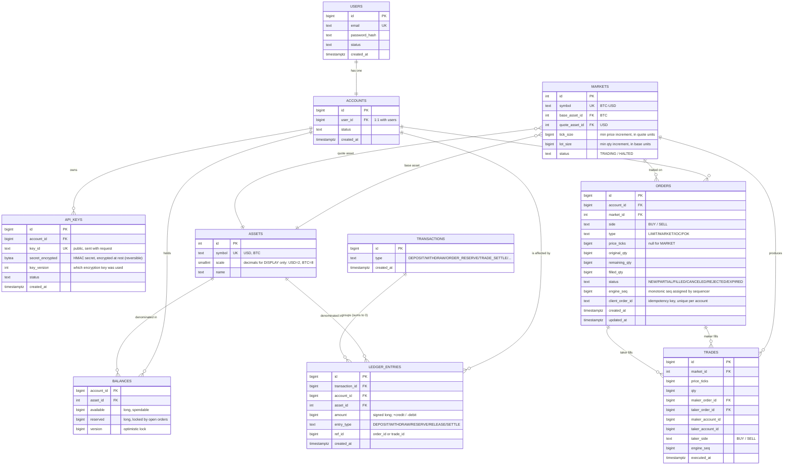

# Data Model & ERD — MatchBox Exchange

> Status: **Draft v1** · Last updated: 2026-06-09
> Read [concepts/02-data-model-erd.md](../concepts/02-data-model-erd.md) first.
> Covers the **persistent** model (Postgres). The in-memory order book is a runtime
> structure, not a table — see [01-requirements-and-scope.md](01-requirements-and-scope.md) §6.

## Decisions locked for v1

| Decision | Choice | Why |
|----------|--------|-----|
| Symbol | single `BTC-USD` | one market keeps Phase 0–1 focused (multi-symbol is Phase 4) |
| Price unit | integer **cents** (`long`) | money is never a float (FR-12) |
| BTC quantity unit | integer **satoshis** (`long`) | 1 BTC = 100,000,000 sat; fits in a `long` |
| User ↔ Account | **1:1**, separate tables | forward-proof for future sub-accounts; teaches 1:1 cleanly |
| Withdrawals | instant, no pending state | simpler ledger for v1 |

## The ERD

## Entity reference

### `users` — login identity *(reference/state)*
Authentication only. `email` is unique. Password stored as a bcrypt/argon2 **hash**, never
plaintext. Separated from `accounts` so a login can later own multiple trading accounts.

### `accounts` — the financial actor *(state)*
Everything money-related points here, not at `users`. v1: exactly one per user (1:1).

### `api_keys` — HMAC credentials *(state)* — *needed once we add order signing*
Each key has a public `key_id` (sent with the request) and a `secret`. The client signs each
order with the secret; the server recomputes the signature to verify. Because HMAC
verification needs the *actual* secret, we store it **encrypted (reversible)**, not one-way
hashed — see [04-auth-and-authz.md](04-auth-and-authz.md). The plaintext is shown to the user
once at creation, never again.

### `assets` — what can be held *(reference)*
Seeded once: `USD` (scale 2), `BTC` (scale 8). `scale` is used **only for display** — all
math is in the smallest integer unit.

### `markets` — a tradable pair *(reference)*
`BTC-USD`: base = BTC (what you're buying), quote = USD (what you pay with). `tick_size` and
`lot_size` enforce valid prices/quantities. v1 has exactly one row.

### `balances` — current holdings *(state, hot)*
PK is the composite `(account_id, asset_id)` — one row per account per asset. Two numbers:
`available` (spendable) and `reserved` (locked by open orders). **Invariant:** placing an
order moves funds available→reserved; a fill moves them out; a cancel moves them back. Never
goes negative. `version` is an optimistic lock to catch concurrent updates.

### `transactions` + `ledger_entries` — the double-entry ledger *(transactional, append-only)*
The source of all balance changes. Every financial event = one `transaction` row + ≥2
`ledger_entries` whose `amount`s **sum to zero per asset**. `balances` is a fast-access
summary; the ledger is the auditable truth. **Append-only — never UPDATE or DELETE a ledger
row** (corrections are new compensating entries).

### `orders` — order lifecycle *(transactional, append + in-place status)*
One row per order; `status` and `remaining_qty` update as it fills. `engine_seq` is the
deterministic sequence number (ties the row to the event stream). `client_order_id` makes
order placement **idempotent** — retrying the same request won't place a duplicate.

### `trades` — executions *(transactional, append-only)*
Each match writes one trade row. **Maker** = the resting order that was already in the book;
**taker** = the incoming order that crossed it. We store both order IDs and both account IDs
so settlement and reconciliation never need extra joins.

## Cardinality summary (say each one out loud)

- A **user** has exactly **one** account; an account belongs to one user. *(1:1)*
- An **account** has **many** API keys, balances, orders, ledger entries. *(1:N)*
- A **market** has one base asset and one quote asset; an asset can be used by many markets. *(N:1 each)*
- An **order** can produce **many** trades (it fills in pieces); each trade has exactly one
  maker order and one taker order. *(1:N, twice)*
- A **transaction** groups **many** ledger entries that sum to zero. *(1:N)*

## Indexing strategy

| Table | Index | Serves the query |
|-------|-------|------------------|
| `users` | unique(`email`) | login lookup |
| `api_keys` | unique(`key_id`) | verify a signed request fast |
| `balances` | PK(`account_id`, `asset_id`) | read/update a specific balance |
| `orders` | (`account_id`, `status`) | "my open orders" |
| `orders` | (`market_id`, `status`) | rebuild the book / open orders per market |
| `orders` | unique(`account_id`, `client_order_id`) | idempotent placement |
| `orders` | (`engine_seq`) | order-by-sequence, replay alignment |
| `trades` | (`market_id`, `executed_at`) | recent trades feed |
| `trades` | (`maker_account_id`), (`taker_account_id`) | a user's fills |
| `trades` | (`market_id`, `engine_seq`) | deterministic ordering |
| `ledger_entries` | (`account_id`, `asset_id`, `created_at`) | account statement |
| `ledger_entries` | (`transaction_id`) | fetch a balanced group |

Index the columns we filter/join/sort by — not "just in case." Each index taxes every insert
on these append-heavy tables.

## Out of scope for the v1 schema (named, not forgotten)

- **`events` / `snapshots` tables (Phase 2 — event sourcing).** The durable event log
  (likely Kafka) becomes the source of truth, and the tables above become *projections* of
  it. We'll redraw this doc then. For v1 (Phase 0–1) Postgres holds the data directly.
- **`candles` / OHLC (Phase 3).** Time-series store (TimescaleDB), not modeled here.
- **Nonce / replay-protection store (auth).** Short-lived; lives in **Redis**, not Postgres.
- Multi-symbol, sub-accounts, fees/commissions, withdrawals-pending — all later.

## Invariants this model must always uphold (turn each into a test/constraint)

1. `SUM(ledger_entries.amount)` per asset across the whole system = **0**.
2. For any account+asset: `available ≥ 0` and `reserved ≥ 0`.
3. An account's `balances` = fold of its `ledger_entries` (reconciliation, FR-23).
4. `orders.filled_qty + orders.remaining_qty = orders.original_qty`, always.
5. A trade's `qty` ≤ the remaining qty of *both* its maker and taker at match time.

## Open questions

- [ ] Fees/commissions in v1? (Proposal: no — add a fee account + entries later.)
- [ ] Do we keep `accounts` separate from `users`, or fold them? (Proposal: keep separate, as above.)
- [ ] `tick_size` / `lot_size` concrete values for BTC-USD? (Proposal: tick = 1 cent, lot = 1 satoshi.)
