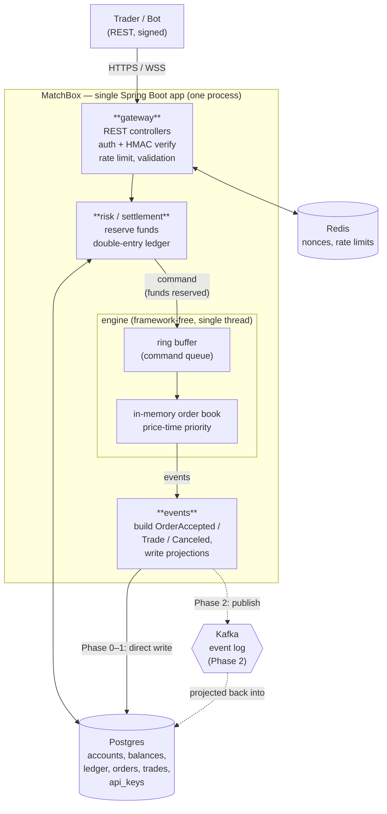
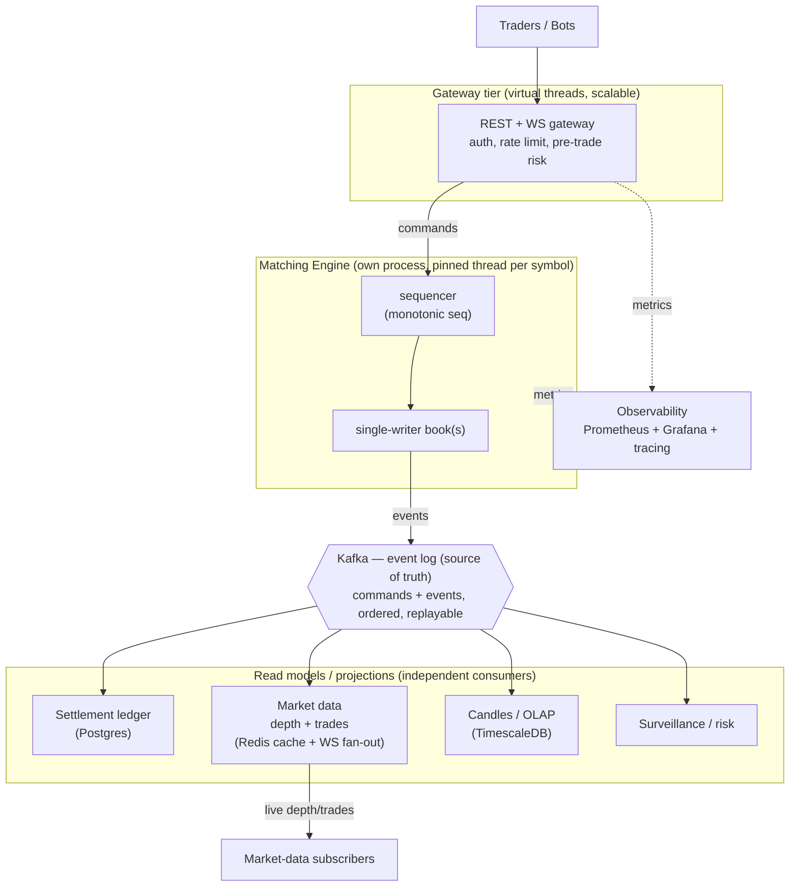

# System Architecture — MatchBox Exchange

> Status: **Draft v1** · Last updated: 2026-06-09
> Read [concepts/05-architecture.md](../concepts/05-architecture.md) first.

## Decision: modular monolith now, split the engine later

| Decision | Choice | Why |
|----------|--------|-----|
| Style (v1, Phase 0–3) | **modular monolith** — one Spring Boot app | simplest correct thing; no network between parts |
| Module boundaries | drawn as if each *could* be a service | so Phase 4 can lift the engine out mechanically |
| Engine | single-writer, in-memory, **framework-free** | the hot path stays lock- and allocation-light |
| Write vs read | **CQRS** — one command path, many projections | exchange read/write needs differ wildly |
| Sync boundary | request → **`202 Accepted` + fills**; everything downstream is async | keep the user path short |

## Context (one-liner)
Traders & bots → **MatchBox** → {Postgres, Redis, Kafka, (later) TimescaleDB, Prometheus}.

## v1 architecture (Phases 0–2): modular monolith

**Request path (place order), synchronous part:**
1. `gateway` authenticates (JWT) + verifies HMAC signature + nonce (Redis) + validates.
2. `risk` reserves funds: moves `available → reserved` in `balances`, writes a ledger
   transaction. If insufficient → `422`, never reaches the engine.
3. The validated, funds-reserved **command** is handed to the engine via the ring buffer.
4. The single engine thread matches against the in-memory book, produces events + fills.
5. `gateway` returns `202 Accepted` with the inline `fills[]`.

**Everything after step 4 is async:** events update the ledger/orders/trades projections (in
Phase 2, via Kafka). The trader doesn't wait for settlement.

> Phases 0–1: the engine runs in-process and we write `orders`/`trades` to Postgres directly.
> Phase 2 inserts Kafka as the durable event log and rebuilds those tables as **projections**
> — the boundary between "engine emits events" and "events update Postgres" already exists, so
> this is an insertion, not a rewrite.

## Target architecture (Phases 3–6): split + queue-driven

The shape is the *same* as v1 — gateway → reserve → engine → events → projections. Phases 3–6
just **pull pieces into their own processes** and let many read models consume the Kafka log
independently. Because v1 already separated these as modules, the split is mechanical.

## Module → (future) service map

| Module (v1 package) | Owns | Becomes (later) |
|---------------------|------|-----------------|
| `gateway` | REST/WS, auth, rate limit, validation | gateway tier (scaled, virtual threads) |
| `security` | JWT, HMAC, nonce, API keys, roles | shared lib / gateway-embedded |
| `engine` | order book, matching, sequencer | **its own process**, pinned thread/symbol |
| `events` | command/event schemas, serialization, outbox | Kafka producers/serde |
| `settlement` | balances, double-entry ledger, reconciliation | Kafka consumer → Postgres |
| `marketdata` | depth/trade/candle projections, WS fan-out | Kafka consumer + Redis + WS tier |
| `analytics` | candle rollups, OLAP, surveillance | Kafka consumer → TimescaleDB |
| `observability` | metrics, tracing, health | cross-cutting |
| `common` | ids, time, fixed-point types | shared lib |

Keep `engine` free of Spring/annotations so it can be lifted out without untangling the
framework. Spring wires everything *around* it.

## Sync vs async boundaries (explicit)

| Interaction | Mode | Why |
|-------------|------|-----|
| client → gateway (place/cancel) | **sync** | trader needs an immediate accept/reject |
| gateway → engine (command) | sync handoff via ring buffer | low-latency, in-process (v1) |
| engine → events → projections | **async** | settlement/market-data/analytics must not block the match |
| market data → WS subscribers | async push | fan-out to many; eventually consistent is fine |
| reconciliation, candle rollups | async / scheduled | batch, off the hot path |

## Deployment (docker-compose, built up over phases)

| Phase | Containers added |
|-------|------------------|
| 0–1 | `matchbox-app`, `postgres-primary`, `redis` |
| 2 | `kafka` (+ kraft) |
| 3 | `timescaledb`, (read-replica `postgres-replica`) |
| 5 | `loadgen` |
| 6 | `prometheus`, `grafana`, `tempo`/`zipkin` |

Add infra **when the phase that needs it arrives** — not before. Each new container should be
solving a problem you can already feel.

## Open questions
- [ ] One engine thread for the single v1 symbol — confirm we defer multi-symbol sharding to
      Phase 4? (Proposal: yes.)
- [ ] Outbox pattern vs direct Kafka publish for engine→log durability in Phase 2? (Decide in
      the event-sourcing phase; affects the `events` module.)
- [ ] Postgres read-replica in v1, or single primary until Phase 3? (Proposal: single primary
      until read load appears in Phase 3.)
